Here's some charts to visualize and better explain what happens in our workflows.

## Charm Workflows

### Quality Checks

This workflows is used by other workflows to perform a series of quality checks on a charm.

### Pull Request

### Release Charm

### Update Libraries

```mermaid
flowchart TD
  start[["⏱️ On a  schedule"]]
  automerge["Merge pre-existing *chore/auto-libs* PRs with green CI"]
  start --> automerge
  checkmajor["Check for **major** charm library updates"]
  automerge --> checkmajor
  openissue["Open a GitHub issue asking to update"]
  checkmajor -->|👍 There is at least a new major version| openissue
  fetchlib["Update minor versions with<br>*charmcraft fetch-lib*"]
  openissue --> fetchlib
  checkmajor -->|👎 No new major version| fetchlib
  createpr["Push to *chore/auto-libs* and create a PR"]
  fetchlib --> createpr

style start stroke-width:3px
```

