# Observability

A repository to collect all the initiatives around Observability currently being
worked on at Canonical.

A list of all the active repositories maintained by the Observability team can be found using the [observability topic](https://github.com/search?q=topic%3Aobservability+org%3Acanonical+fork%3Atrue+archived%3Afalse&type=repositories).

Want to know more? See the [CharmHub topic page on Observability](https://charmhub.io/topics/canonical-observability-stack).

## GitHub Workflows

```mermaid
block-beta
  block
    columns 1
    charm["<b>Charm Workflows</b>"]
    charmpr["<a href='https://github.com/canonical/observability/blob/feature/v1/.github/workflows/charm-pull-request.yaml'>Quality checks (on PRs)</a>"]
    charmrelease["<a href='https://github.com/canonical/observability/blob/feature/v1/.github/workflows/charm-release.yaml' >Release (push to <i>main</i> or <i>track/N</i>)</a>"]
    charmupdate["<a href='https://github.com/canonical/observability/blob/feature/v1/.github/workflows/charm-update-libs.yaml'>🕛 Update charm libraries</a>"]
    charmpromote["<a href='https://github.com/canonical/observability/blob/feature/v1/.github/workflows/charm-promote.yaml'>🖐 Promote charm</a>"]
  end

  block
    columns 1
    rock["<b>Rock Workflows</b>"]
    rockpr["<a href='https://github.com/canonical/observability/blob/feature/v1/.github/workflows/rock-pull-request.yaml'>Goss checks (on PRs)</a>"]
    rockreleasedev["<a href='https://github.com/canonical/observability/blob/feature/v1/.github/workflows/rock-release-dev.yaml'>Release to GHCR:dev</a>"]
    rockreleaseoci["<a href='https://github.com/canonical/observability/blob/feature/v1/.github/workflows/rock-release-oci-factory.yaml'>Open PR to OCI Factory</a>"]
    rockupdate["<a href='https://github.com/canonical/observability/blob/feature/v1/.github/workflows/rock-update.yaml'>🕛 Update from upstream</a>"]
  end

style charm fill:darkslategray,stroke-width:4px
style rock fill:teal,stroke-width:4px
```



> 🕛: workflows running periodically; 🖐: manual workflows

This repository holds all of our **reusable workflows**, in the `.github/workflows` folder; our other repositories implement their workflows by calling these. We follow two conventions for naming them:
- workflows starting with `_` are *“private”*, meaning they are used by other workflows and shouldn't be called from outside this repository;
- the name should loosely follow a `{scope}-{function}.yaml` schema, to make the folder easily searchable.

Our approach to CI follows some **guiding principles**:
- **simplicity**: our workflows strive to minimize the amount of moving parts (external actions and tooling);
- **stability**: our workflows should be tested (e.g., statically and manually on [`o11y-tester`](https://github.com/canonical/o11y-tester-operator)) and versioned, to avoid breaking us and other users;
- **repeatability**: when possible, workflows should be composed of commands that are also executable locally, in order to ease testing;
- **decoupling from GitHub CI**: minimize the amount of GitHub-specific features (e.g., actions), relying on Bash where possible.

To contribute, please read CONTRIBUTING.md # TODO: add a link to the file! (move guiding principles there and change the wording to "to read our guiding principles and learning how to contribute" or something similar


### Charm Workflows

Our charms default branches are **main** and **track/N**. When a PR is opened or merged to one of those branches, some quality checks are executed (*fast* and *integration* in the chart below), and on merge the charm is automatically released to the appropriate track (for all the defined architetures):


> [!note]
> By default, integration tests are executed in parallel: each `test_*.py` file is executed on a separate runner. This behavior can be disabled via a flag. # TODO: add link to the parallelize-integration flag

### Rock Workflows

Our rocks are built in [oci-factory](https://github.com/canonical/oci-factory/), which covers:
- building and publishing the rocks to [DockerHub](https://hub.docker.com/u/ubuntu);
- tagging with semantic versions (e.g., `prometheus:{major}` pointing to the latest `prometheus:{major}.{minor}.{patch}`)
- periodically rebuilding rocks to pull any security fix.


These workflows make the repositories holding our rocks *almost* fully automated: human intervention is only required when on workflow failures, which could indicate that the building process changed, or that the rock has a security vulnerability.

## Other automation

### Issue sync to Jira

Issues are synced by the [gh-jira-sync-bot](https://github.com/canonical/gh-jira-sync-bot/blob/main/README.md), and further enriched by a *Jira Automation*.

The bot configuration lives in [.github/.jira_sync_config.yaml](https://github.com/canonical/observability/blob/main/.github/.jira_sync_config.yaml); *carefully* read the README to configure it. This 
takes care of most things, except the Jira labels, which are added by the *Jira automation*.

## Meta Repo

This repo also contains the manifest (`manifest.yaml`) for syncing all repositories maintained by the observability team.
The script assumes that you want to place all repos in the parent folder of the `observability` repo. To use it, do the following:

```
# install the git-metarepo module
$ pip3 install metarepo

# sync the repos using the manifest
$ git meta sync
```
## Scripts
This repo also contains a `scripts` directory that could hold helper scripts for COS charms and bundles as `pip-installables`.

### `render-bundle`
This helper script is used by COS bundles as a `pip` package in a `tox.ini` file to render a `bundle.yaml.j2` template into a `bundle.yaml` file that can be deployed using `juju deploy ./bundle.yaml`.

### Contributing
To add similar helper scripts (e.g: `my_helper.py`) to be used as a `pip` package:

1. Add the script inside `scripts` directory.
2. In `scripts/pyproject.toml`, under `[project.scripts]`, add an entrypoint to your newly added script.
