# Observability

[Observability Repositories](https://documentation.ubuntu.com/observability/reference/charms/) | [How to Contribute](https://github.com/canonical/observability/blob/main/CONTRIBUTING.md) 

A repository to collect all the initiatives around Observability currently being worked on at Canonical.

This repository uses [`just`](https://github.com/casey/just) to execute quality checks and generally useful operations; you can install it via Snap. To list the available commands, simply run `just`.

## GitHub Workflows

```mermaid
block-beta
  block
    columns 1
    charm["<b>Charm Workflows</b>"]
    charmpr["<a href='https://github.com/canonical/observability/blob/v1/.github/workflows/charm-pull-request.yaml'>Quality checks (on PRs)</a>"]
    charmrelease["<a href='https://github.com/canonical/observability/blob/v1/.github/workflows/charm-release.yaml' >Release (push to <i>main</i> or <i>track/N</i>)</a>"]
    charmupdate["<a href='https://github.com/canonical/observability/blob/v1/.github/workflows/charm-update-libs.yaml'>🕛 Update charm libraries</a>"]
    charmqualitygates["<a href='https://github.com/canonical/observability/blob/v1/.github/workflows/charm-quality-gates.yaml'>🕛 Quality Gates</a>"]
    charmpromote["<a href='https://github.com/canonical/observability/blob/v1/.github/workflows/charm-promote.yaml'>🖐 Promote charm</a>"]
  end

  block
    columns 1
    rock["<b>Rock Workflows</b>"]
    rockpr["<a href='https://github.com/canonical/observability/blob/v1/.github/workflows/rock-pull-request.yaml'>Goss checks (on PRs)</a>"]
    rockreleasedev["<a href='https://github.com/canonical/observability/blob/v1/.github/workflows/rock-release-dev.yaml'>Release to GHCR:dev</a>"]
    rockreleaseoci["<a href='https://github.com/canonical/observability/blob/v1/.github/workflows/rock-release-oci-factory.yaml'>Open PR to OCI Factory</a>"]
    rockupdate["<a href='https://github.com/canonical/observability/blob/v1/.github/workflows/rock-update.yaml'>🕛 Update from upstream</a>"]
  end

style charm fill:darkslategray,stroke-width:4px
style rock fill:teal,stroke-width:4px
```

> **Legend**: 🕛 workflows running periodically | 🖐 manual workflows

To contribute, please read about our guiding principles and contribution guidelines in our [CONTRIBUTING.md](https://github.com/canonical/observability/blob/main/CONTRIBUTING.md).

### Charm Workflows

Our charms default branches are **main** and **track/N**. When a PR is opened or merged to one of those branches, some quality checks are executed (*fast* and *integration* in the chart below), and on merge the charm is automatically released to the appropriate track (for all the defined architetures):

> [!tip]
> Integration tests are executed in parallel: each `test_*.py` file is executed on a separate runner. This behavior can be disabled via a [flag](https://github.com/canonical/observability/blob/v1/.github/workflows/charm-pull-request.yaml#L28-L33).
>
> The charm is packed before the tests are executed and exposed via the `CHARM_PATH` environment variable. Make sure to [use it](https://github.com/canonical/o11y-tester-operator/blob/f9fa9f4014c248c07d664069422a47a18f9befea/tests/integration/conftest.py#L40-L49) in your integration tests to avoid re-packing.

#### Periodic Workflows

The following workflows are executed on a schedule:
- [Update charm libraries](https://github.com/canonical/observability/blob/v1/.github/workflows/charm-update-libs.yaml) checks whether the charm libraries are up-to-date or not: if there is a new major version for a charm library, a GitHub issue is opened; if there's minor version updates, a PR is automatically created and (eventually, when CI passes) auto-merged;
- [Quality Gates](https://github.com/canonical/observability/blob/v1/.github/workflows/charm-quality-gates.yaml) runs the checks we are using to gate promotions between channel; if those checks are successful, this workflows takes care of the promotions (up to the `candidate` risk).

### Rock Workflows

Our rocks are built in [oci-factory](https://github.com/canonical/oci-factory/), which covers:
- building and publishing the rocks to [DockerHub](https://hub.docker.com/u/ubuntu);
- tagging with semantic versions (e.g., `prometheus:{major}` pointing to the latest `prometheus:{major}.{minor}.{patch}`)
- periodically rebuilding rocks to pull any security fix.

These workflows make the repositories holding our rocks *almost* fully automated: human intervention is only required when on workflow failures, which could indicate that the building process changed, or that the rock has a security vulnerability.

## Other Automation

### Issue Sync to Jira

Issues are synced by the [gh-jira-sync-bot](https://github.com/canonical/gh-jira-sync-bot/blob/main/README.md), and further enriched by a *Jira Automation*.

The bot configuration lives in [.github/.jira_sync_config.yaml](https://github.com/canonical/observability/blob/main/.github/.jira_sync_config.yaml); *carefully* read the README to configure it. This 
takes care of most things, except the Jira labels, which are added by the *Jira automation*.

## Terraform

The COS product Terraform modules exist in [observability-stack/terraform](https://github.com/canonical/observability-stack/tree/main/terraform/), where you can find references to all the other Observability charm Terraform modules.

## Scripts

This repository contains a `scripts` directory for helper scripts of various nature as `pip-installables`.

| Script | Description |
|---|---|
| **render-bundle** | Render a `bundle.yaml.j2` template into a `bundle.yaml`. Used by the `cos-lite` bundle. |
