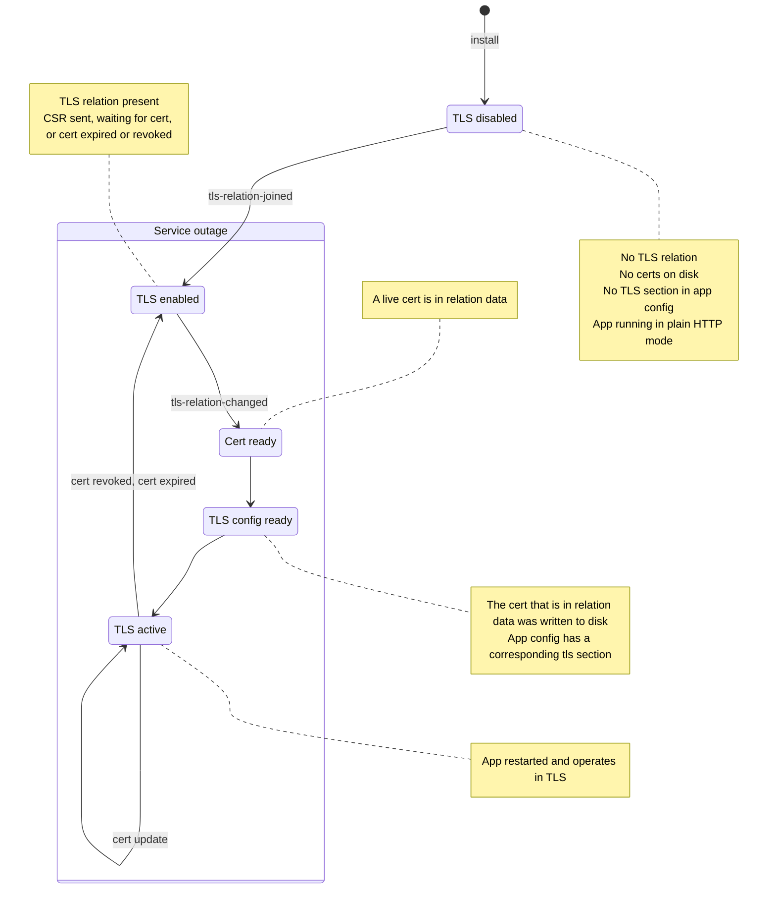
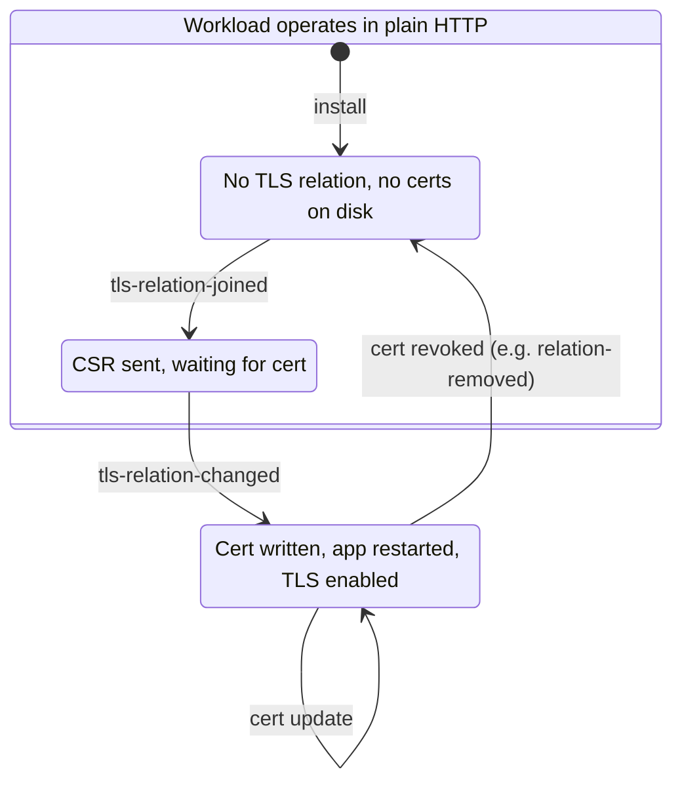

**Date:** 2024-06-04 
**Author:** @sed-i

## Context and Problem Statement
When an admin forms a tls relation, there is a time window in which:

1. the juju model tells us we must operate with TLS enabled (the desired/planned state); however
2. we haven't received the server cert yet (actual, transient state).

As a result we had some code ordering issues (e.g. #414):
- Should we update the config file with the tls config, which includes path to
  the cert, before we got the cert, only to perfectly reflect the juju model?
- Should we wait with the tls config and allow the workload to continue to
  operate in plain http, in contradiction to the juju model?
- How should we determine within the charm if "TLS is enabled"?

This problem is common to many charms.

## Decision
A server shall NOT keep using plain http while waiting for a cert. The service
must be stopped until the cert is in place.
The charm shall have a "Waiting" status during that period (subject to other
status priorities).

We also distinguish between several substates:
- TLS disabled: a tls-certificate is not in place, no certs on disk, no tls
  section in app config, app is running in plain HTTP mode.
- TLS enabled: a tls-certificate relation is present.
- Cert ready: we have a cert in relation data.
- TLS config ready: the cert that is in relation data was written to disk, and
  app config has a corresponding tls section.
- TLS active: the app is running with the new config.

## Benefits
- No need to worry if it takes the cert a long time to arrive.
- We stick to the juju model (no model departure): if admin says HTTPS, then no
  more plain HTTP.

## Disadvantages
- We may incur data loss if the cert takes so long to arrive that clients begin
  to drop data due to back-pressure.

## Alternatives considered
- Keep operating in plain http until we receive the cert.

