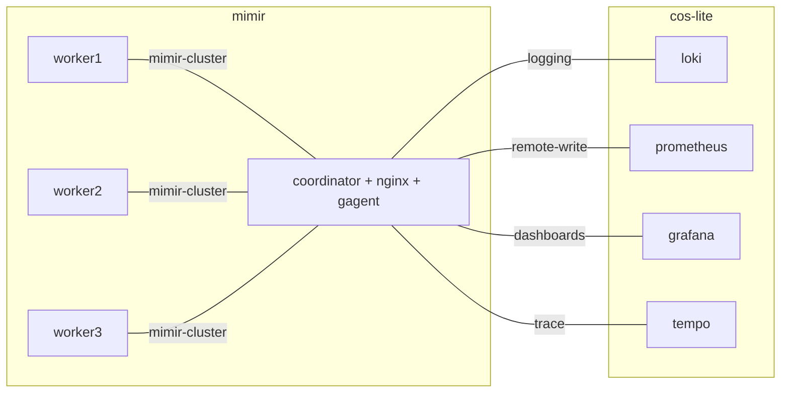

# Coordinated multirole workers
**Date:** 2024-06-13 
**Authors:**

TODO: Pick one of marxist/bourgeois below

## Context and Problem Statement
We have charms for several grafana products, loki, mimir, and tempo, that all share the same design
(with some variations): A single executable that, depending on the CLI args it is executed with,
can be run in monolithic mode (i.e. a single process running all services) or microservices mode.
What microservice mode means varies per product:

- **Mimir**: each process runs an arbitrary subset of all the services, or certain predefined subsets
- **Loki**: each process runs one of three predefined subsets of all the services
  (see [Loki HA design roles](2024-06-05--loki-ha-design-roles.md))
- **Tempo**: each process runs exactly one service

In the above grafana products, services are called `roles`, and the 'predefined subsets' of
all existing roles for a product are called `meta-roles`.

The set of required roles which are necessary for the deployment as a whole to be functional
(or, "consistent") varies per product. Certain roles can be optional, in that they aren't part of
the minimal consistent deployment requirements.

We want to adopt a uniform design pattern for the architecture of all three charmed products.

## Decision

### Coordinator-worker pattern
Each charmed solution will consist of a single coordinator charm, and a generic worker charm that
can be configured by the cloud admin to run any role (or meta-role) or combination thereof,
depending on what the application supports.

Derived decisions:
- The entire pattern is made up of two charms: worker and coordinator.
- The coordinator runs a reverse proxy to the workers. It also load-balances across workers of the same role.
- The coordinator, not the worker, owns all rule files, dashboards.
- Worker's role is set via a worker's config option.
- We cannot have panels that filter metrics by role (and thus **we shouldn't add a `roles` label**), because
  even if we added a label for it, they would be showing inaccurate data unless each worker had exactly one role.
- Self-monitoring metrics should be scraped by the coordinator through a grafana-agent in a sidecar container
  in the coordinator charm.

## Benefits
The presence of a coordinator charm achieves several goals:
- a **single entrypoint** for all communication with the clustered application: it will
  typically run an nginx instance to reverse-proxy all communication to the workers
- Cleaner juju topology:
  we expose a single facade for integrating with other charms: for example, we don't have to
  relate each worker with s3: we only relate the coordinator, and the coordinator
  forwards the appropriate config to the workers.
- The coordinator charm is responsible for configuring and coordinating the workers, and can
  **verify the consistency** of the cluster, that is, verify that the all required roles are
  deployed. Without a coordinator, that would have to be implemented as a distributed decision by
  cross-relating all workers.

## Disadvantages

## Alternatives considered

### "Marxist coordinator": Coordinator is a worker too

#### Benefits
- One charm instead of two, operating in two modes, so less charms to maintain.
- Can readily switch a deployment from monolithic to microservices mode.

#### Disadvantages
- Implementation complexity:
  - The coordinator has to be able to decide when to run the worker as a monolith and when not to.
  - Potential difficulties on unit leadership status change.

### "Bourgeois coordinator": Coordinator is not a worker
#### Advantages
- Clear separation of concerns, so simpler implementation.

#### Disadvantages
- Cannot readily switch a deployment from monolithic to microservices mode.

## Misc. rejected ideas
### Determine worker roles using multiple relation endpoints (one per each role)
Impractical and a poor UX for the user. When elaborating on the `juju config` proposal, we came up with two alternatives:
* having a `role` config variable, to set to a comma-separated list of roles (e.g., `ingester,querier,distributor`);
  while being simpler to set, it's less resilient to typos in the configuration. If a user sets the role to `quorier`,
  then we'll get *Model departure* (the model configuration will drift from the application state).
* having one boolean config variable per each Mimir role (e.g., `role-querier`, `role-ingester`, etc.) to act as toggles
  for each role. This solves the "typo issue", as the variable type is validated as a boolean by Juju.

We asked stakeholders for a UX opinion, and it aligned with our personal conclusions: having boolean config variables
makes for a better and more resilient approach.

