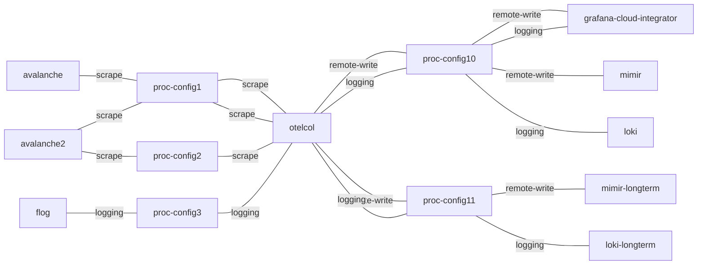

# Arbitrary config for OpenTelemetry Collector
**Date:** 2025-03-17

**Authors:** Jose Massón, @sed-i

## History
- 2025-03-17 Initial adr by Jose Massón


## Context and Problem Statement

Unlike Grafana-agent, OpenTelemetry Collector allows us enable multiple receivers, processors, exporters and extensions. This of course provides a flexibility we did not have with grafana-agent, but that flexibility comes at an additional cost: The configuration file tend to be more complex.

Generating complex configurations is not trivial nor flexible in an event-driven system like Juju. So we need to come up with a solution that produces out-of-the-box a simple and functional configuration but with the possibility of enhance it with arbitrary configs.

The OpenTelemetry Collector config file has 5 main sections:


| Section     | Description                                                                   |
| ----------- | ----------------------------------------------------------------------------- |
| `receivers` | To define where datasources are configured (logs, metrics, traces).           |
| `processors`| To modify, filter or transform the data before sending them.                  |
| `exporters` | To define where telemetry is going to be sent. (Loki, Prometheus, OTLP, etc.).|
| `service`   | To define the pipelines which connects receivers, processors and exporters.   |
| `extensions`| To configure extra features like health checks, authentication, encoding, etc.|


While
- `receivers` and `exporters` sections could be auto-generated based on the joint relations; and
- `extensions` section (e.g. health_check, pprof) could be very opinionated,

the potential combinations of various `processors` per different `service`s is difficult to model with juju.


## Alternative 1: Specify processor config and pipline mapping via juju config options

In order to include `processors` or `extensions` we may use `juju config`.

Let's imagine we want to enable the
[`metricsgeneratorprocessor`](https://github.com/open-telemetry/opentelemetry-collector-contrib/tree/main/processor/metricsgenerationprocessor)
to the `metrics` pipeline, and the
[`batch`](https://github.com/open-telemetry/opentelemetry-collector/tree/main/processor/batchprocessor) processor to the
`logs` and `metrics` pipelines, we need to create a file like this one:

```yaml
processors:
  metricsgenerator:
      rules:
          # create pod.cpu.utilized following (pod.cpu.usage / node.cpu.limit)
          - name: pod.cpu.utilized
            type: calculate
            metric1: pod.cpu.usage
            metric2: node.cpu.limit
            operation: divide

          # create pod.memory.usage.bytes from pod.memory.usage.megabytes
          - name: pod.memory.usage.bytes
            unit: Bytes
            type: scale
            metric1: pod.memory.usage.megabytes
            operation: multiply
            scale_by: 1048576

    batch:
      send_batch_max_size: 10000
      timeout: 0s
```

And then run:

```shell
juju config otel-col processors='@path/to/processors-config.yaml' proc_pipeline_map="metricsgenerator:metrics;batch:metrics,logs"
```

Once this config is added, the new section `processors` will be added, and the `service` section will be like this:

```yaml
service:
  pipelines:
    metrics:
      receivers: [otlp, prometheus_remote_write, prometheus]
      processors: [batch, metricsgenerator]
      exporters: [otlphttp/cos-mimir]

    logs:
      receivers: [otlp, filelog]
      processors: [batch]
      exporters: [otlphttp/cos-loki]

    traces:
      receivers: [otlp]
      exporters: [otlphttp/cos-tempo]
```

### Advantages
- Admin has full flexibility over otelcol config.

### Disadvantages
- Potential negative interaction between user config and how the charm configures the otelcol.
- It would be tedious to come up with, and maintain the `proc_pipeline_map` config option.
  - Simplest typos could badly break the entire setup.


## Alternative 2: All sources (receivers) go into all sinks (exporters)

- Inside the otelcol charm, all sources (receivers) go into all sinks (exporters) - the same pipeline used per
  (incoming, outgoing) relation pair.
- Arbitrary config is accomplished by dividing the otelcol config into multiple, composable workloadless integrator charms.
- The new "otelcol-processors-config" charm will:
  - have to implement all the telemetry relations otelcol has.
    - have a config option for "raw yaml" processors config which the admin would need to provide.
- The otelcol charm will generate a config file from combining the processors configs from all incoming and outgoing
  relations.

(The particular details would be outlined in detail in a dedicated spec.)




### Advantages
- By imposing the "all sources go to all sinks" restriction, we are able to fully model arbitrary pipeline architectures
  using juju primitives.
- Design is consistent with tiered otelcol setups.

### Disadvantages
- Would need to augment existing relation schemas (prometheus scrape/remote-write, loki logging, tempo tracing) with
  otelcol-specific information (processor config).


## References
- https://opentelemetry.io/docs/collector/configuration/


---


## Appendices

### Appendix: Sample config for cos-agent relation
for example if we implement `cos-agent` interface we could generate something like this:

```yaml
receivers:
  prometheus:
    config:
      scrape_configs:
        - job_name: "my-app"
          static_configs:
            - targets: ["localhost:9090"]

  prometheus_remote_write:
    endpoint: 0.0.0.0:12345

  # To read logs from disk
  filelog:
    include: ["/var/log/my-app.log"]
    start_at: beginning

  otlp:
    protocols:
      grpc:
        endpoint: "0.0.0.0:4317"
      http:
        endpoint: "0.0.0.0:4318"
```


The `exporters` sections could also be auto-generated based on the relations established, for example:

```yaml
exporters:
  otlphttp/cos-loki:
    endpoint: "http://cos-loki:3100/otlp"

  otlphttp/cos-mimir:
    endpoint: "http://cos-mimir/otlp"

  otlphttp/cos-tempo:
    endpoint: "http://cos-tempo"
```

Finally, the `service` section will relate `receivers` and `exporters`

```yaml
service:
  pipelines:
    metrics:
      receivers: [otlp, prometheus_remote_write, prometheus]
      exporters: [otlphttp/cos-mimir]

    logs:
      receivers: [otlp, filelog]
      exporters: [otlphttp/cos-loki]

    traces:
      receivers: [otlp]
      exporters: [otlphttp/cos-tempo]
```

## Appendix: Topology with complex, more realistic config
Let's imagine this deployment in which we want to:

- Send unmodified telemetry to COS
- Send modified/anonymised telemetry to Grafana Cloud
- Send modified/anonymised telemetry to Splunk


[](https://mermaid.live/edit#pako:eNqNlMtugzAQRX8FeR36ASyySapuGnWRrFpXkWsPYMUvGbtRlOTfaxsCiiCkXsCM78U-gx9nRDUDVKBS6COtiXXZbo0VVo3_qSwxdcbACH2SoNwXRi8YfUc161rvskCB_4JtBi02Y7UEV4N_2L-3ILWD_dFyB_emkgsQurrv1E6YoQcUG5IwjKBaBMwuSrA3tSfM8nx588ZaWktfCRXas2aixMYIrw5h9G0K7gaPLaA2QX0Pr5EWirWcRnnTRiOHs4RCNOxScKenKieIwrMkiuQJOXz61ubZKuYTfAdeJcADHwNyyW1UNzEY04E0Osq7GPwLjupYzepjOwkyyzGP8ZiiDzqmbpHDgufLS9wVwtTOGYwuiWHWkEBmHQnm6STV81mq59NMW6Lc7kqs0AJJsJJwFg7zOf4LjMIBk4BREUIGJfHCYYTVNVi9YcTBK-NOW1SURDSwQMQ7vT0pigpnPdxMa07CgsreBemjTXtrpMtjgQxRn1oPHqt9VXfZ9Q8B0mHl)


In order to do that, we need to create a file with the following processors' definition:

```yaml
processors:
  batch:
  resource:
    attributes:
      - key: service.name
        value: "principal_charm"
        action: upsert

  attributes/anonymizer:
    actions:
      - action: delete
        key: user.id
      - action: update
        key: client.ip
        value: "CLIENT.IP"
```


and run:

```shell
juju config otel-col processors='@path/to/processors-config.yaml' proc_pipeline_map="batch:logs/cos,logs/grafana,logs/splunk,metrics/cos,metrics/grafana,metrics/splunk,traces/cos,traces/grafana,traces/splunk;resources:logs/cos,logs/grafana,logs/splunk,metrics/cos,metrics/grafana,metrics/splunk,traces/cos,traces/grafana,traces/splunk;attributes/anonymizer:logs/grafana,logs/splunk"
```


In a deployment like this one, a `otelcol` config would look like this way:

```yaml

# The receivers and exportes should be added automatically based on the established relations:
# - otelcol --> mimir
# - otelcol --> loki
# - otelcol --> tempo

# About otlp and Mimir, Loki and Tempo:
# - https://grafana.com/docs/mimir/latest/configure/configure-otel-collector/#configure-the-opentelemetry-collector-to-write-metrics-into-mimir
# - https://grafana.com/docs/loki/latest/send-data/otel/#configure-the-opentelemetry-collector-to-write-logs-into-loki
# - https://medium.com/cloud-native-daily/level-up-your-tracing-platform-opentelemetry-grafana-tempo-8db66d7462e2

receivers:
  # to scrape principal/node metrics endpoint
  #
  # this receiver can be added when the relation with the principal is established
  # since we are going to install node-exporter alongside otelcol
  prometheus:
    config:
      scrape_configs:
        - job_name: "principal_charm"
          static_configs:
            - targets: ["localhost:9090"]


  # to receive metrics through remote-write
  #
  # This receiver can be added when a relation with Grafana-agent is established.
  prometheus_remote_write:
    endpoint: 0.0.0.0:12345

  # to "scrape" principal/node log files.
  #
  # This receiver can be added when the relation with the Principal is established.
  filelog:
    include: ["/var/log/principal-charm.log"]
    start_at: beginning

  # to receive traces, logs and metrics
  #
  # This receiver is added at deployment time since it is the default one.
  otlp:
    protocols:
      grpc:
        endpoint: "localhost:4317"
      http:
        endpoint: "localhost:4318"

exporters:
  # COS
  otlphttp/cos-loki:
    endpoint: "http://cos-loki:3100/otlp"
  otlphttp/cos-mimir:
    endpoint: "http://cos-mimir/otlp"
  otlphttp/cos-tempo:
    endpoint: "http://cos-tempo"

  # Grafana Cloud
  otlphttp/grafana-loki:
    endpoint: "https://grafana-loki.com:3100/otlp"
  otlphttp/grafana-mimir:
    endpoint: "https://grafana-mimir.com/api/v1/push"
  otlphttp/grafana-tempo:
    endpoint: "https://grafana-tempo.com"

  # Splunk
  otlp/splunk:
    endpoint: "https://splunk-endpoint"


# The processors can be added using `juju config` or with a configurator charm.

processors:
  batch:
  resource:
    attributes:
      - key: service.name
        value: "principal_charm"
        action: upsert

  attributes/anonymizer:
    actions:
      - action: delete
        key: user.id
      - action: update
        key: client.ip
        value: "CLIENT.IP"


# The pipelines should be created taking into account:
# - The receivers
# - The exporters
# - The processors added to each pipeline using `juju config` and/or a configurator charm
service:
  pipelines:
    logs/cos:
      receivers: [filelog, otlp]
      processors: [batch, resource]
      exporters: [otlphttp/cos-loki]

    logs/grafana:
      receivers: [filelog, otlp]
      processors: [batch, resource, attributes/anonymizer]
      exporters: [otlphttp/grafana-loki]

    logs/splunk:
      receivers: [filelog, otlp]
      processors: [batch, resource, attributes/anonymizer]
      exporters: [otlp/splunk]

    metrics/cos:
      receivers: [prometheus, prometheus_remote_write, otlp]
      processors: [batch, resource]
      exporters: [otlphttp/cos-mimir]

    metrics/grafana:
      receivers: [prometheus, prometheus_remote_write, otlp]
      processors: [batch, resource]
      exporters: [otlphttp/grafana-mimir]

    metrics/splunk:
      receivers: [prometheus, prometheus_remote_write, otlp]
      processors: [batch, resource]
      exporters: [otlp/splunk]

    traces/cos:
      receivers: [otlp]
      processors: [batch, resource]
      exporters: [otlphttp/cos-tempo]

    traces/grafana:
      receivers: [otlp]
      processors: [batch, resource]
      exporters: [otlphttp/grafana-tempo]

    traces/splunk:
      receivers: [otlp]
      processors: [batch, resource]
      exporters: [otlp/splunk]
```