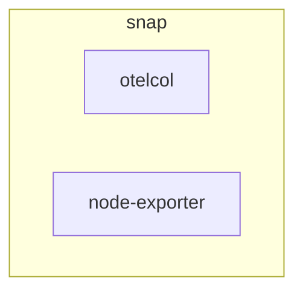

# Node-exporter inside or alongside otelcol charm
**Date:** 2025-03-20

**Authors:** Jose Massón

## Context and Problem Statement

The [Prometheus Node Exporter](https://prometheus.io/docs/guides/node-exporter/) binary exposes a wide variety of hardware and kernel-related metrics.

In the case of `grafana-agent`, it comes with an embedded version of `node-exporter` which is very practical since every time we deploy a `grafana-agent` charm, `node-exporter` is also running so we can collect metrics from the host in which they are running.

On the other hand OpenTelemetry Collector has a [Host Metrics Receiver](https://github.com/open-telemetry/opentelemetry-collector-contrib/blob/main/receiver/hostmetricsreceiver/README.md) which can be enabled in the configuration. But this receiver does not exposes the same metrics `node-exporter` does, so all the charms relying on these metrics to generate dashboards and alert rules would have to be modifierd.

Since there is no `node-exporter` embedded in `otelcol` we need to come up with a solution in order to keep the feature parity with `grafana-agent`.

## Alternative 1: Add `node-exporter` as a second `app` in [`opentelemetry-collector-snap`](https://github.com/canonical/opentelemetry-collector-snap)

Although this alternative is quite simple in terms of the modification of the snap, we should also modify the snap name since it won't only be `otelcol`. It will be `otelcol` + `node-exporter`.

By default `node-exporter` exports host metrics in the port `9100`. In order to support [parallel installs](https://snapcraft.io/docs/parallel-installs) we should add a config option to the snap so we can [arbitrary change the port number](https://stackoverflow.com/a/57215681

This way we could potentially install the same snap several times in a `host`.

## Alternative 2: Install [`node-exporter` snap](https://snapcraft.io/node-exporter) 
