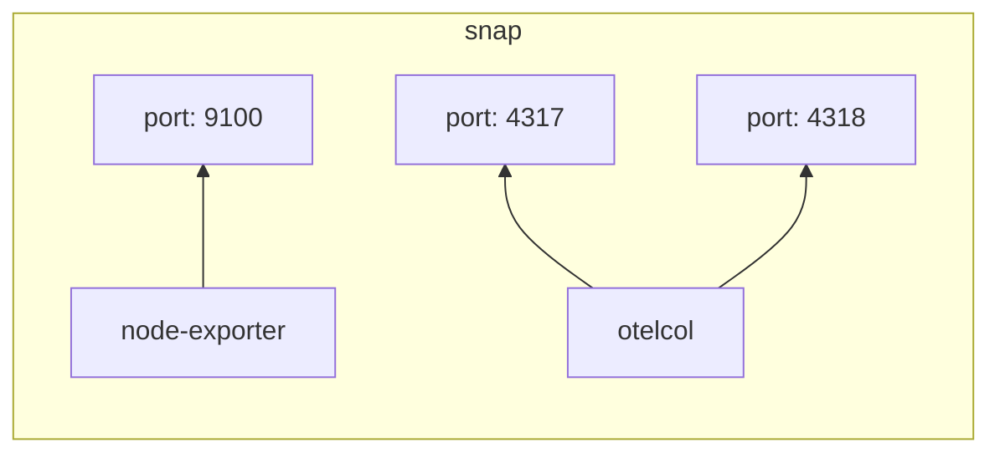
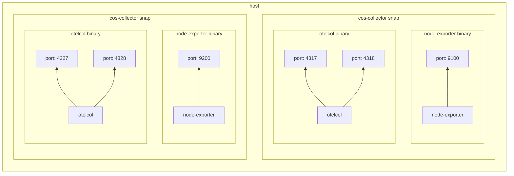
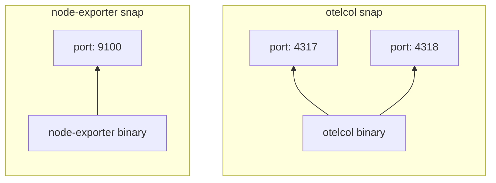
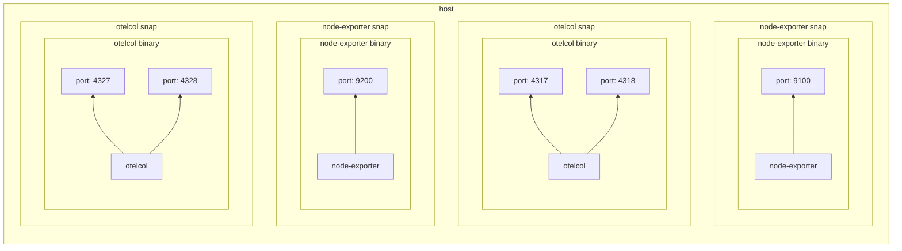
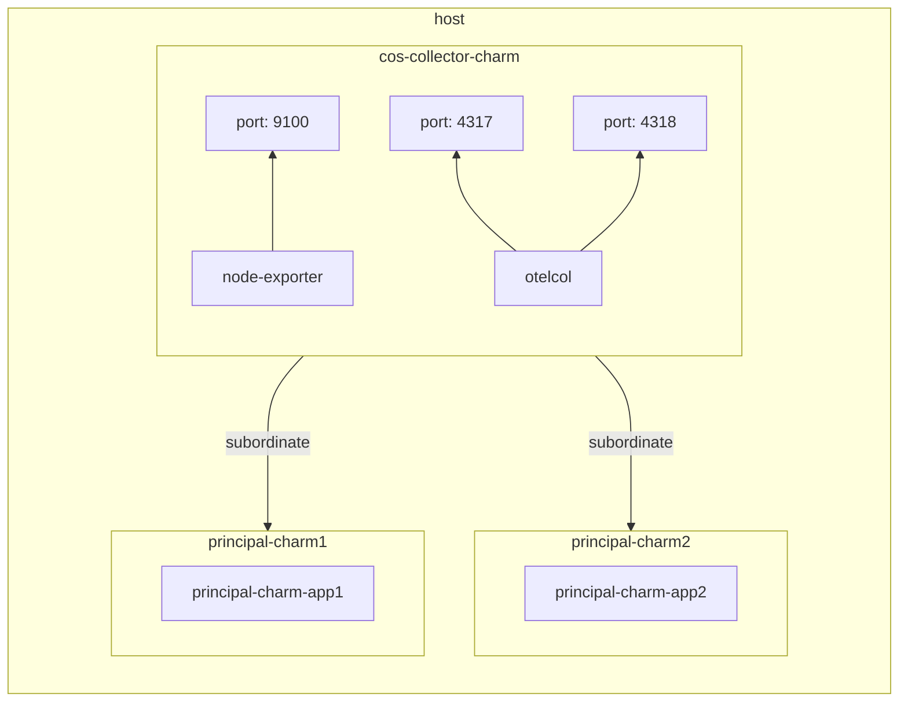
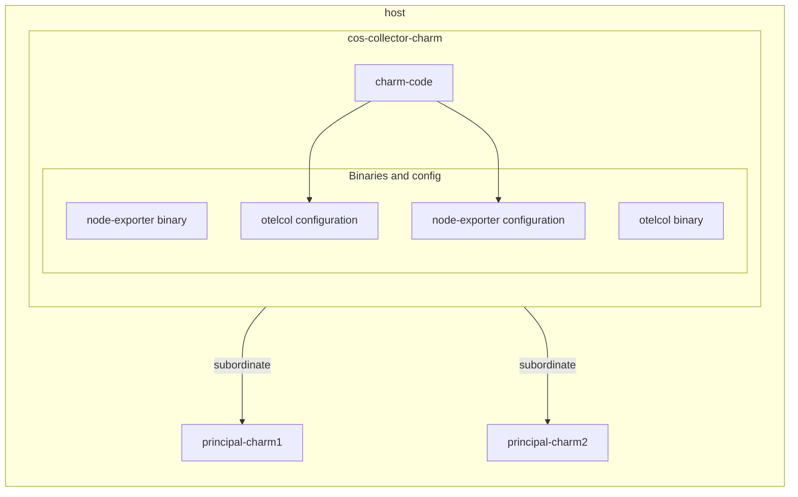
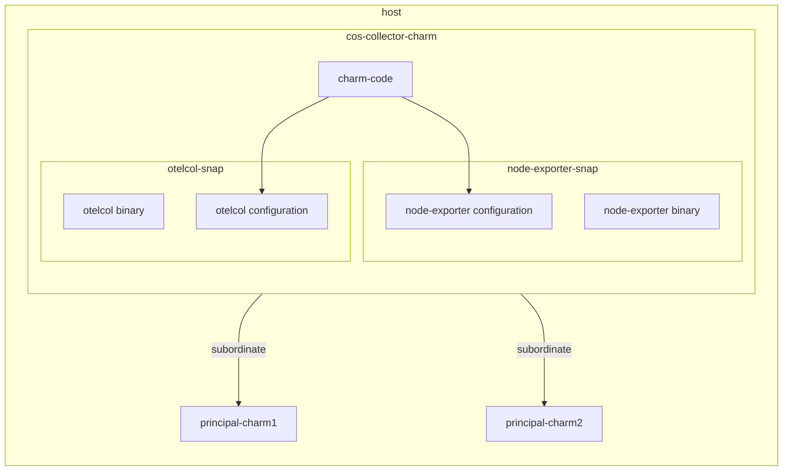

# Node-exporter + otelcol
**Date:** 2025-03-20

**Authors:** Jose Massón

<!-- markdown-toc start - Don't edit this section. Run M-x markdown-toc-refresh-toc -->
**Table of Contents**

- [Node-exporter + otelcol](#node-exporter--otelcol)
    - [Context and Problem Statement](#context-and-problem-statement)
    - [One `otelcol` + `node-exporter` binaries per Principal charm (make use of snaps `parallel install` feature)](#one-otelcol--node-exporter-binaries-per-principal-charm-make-use-of-snaps-parallel-install-feature)
        - [Alternative 1: Add `node-exporter` as a second `app` in `opentelemetry-collector-snap`](#alternative-1-add-node-exporter-as-a-second-app-in-opentelemetry-collector-snap)
            - [Advantages](#advantages)
            - [Disadvantages](#disadvantages)
        - [Alternative 2: Install `node-exporter` as a separate snap](#alternative-2-install-node-exporter-as-a-separate-snap)
            - [Advantages](#advantages-1)
            - [Disadvantages](#disadvantages-1)
        - [General comments about Alternative 1 and Alternative 2](#general-comments-about-alternative-1-and-alternative-2)
            - [Enable the feature in the host.](#enable-the-feature-in-the-host)
            - [Ports management](#ports-management)
            - [Parallel installation of snaps](#parallel-installation-of-snaps)
            - [Questions and doubts about this approach](#questions-and-doubts-about-this-approach)
    - [Only one `otelcol` + `node-exporter` binaries per `cos-collector` charm (and per principal charm and host)](#only-one-otelcol--node-exporter-binaries-per-cos-collector-charm-and-per-principal-charm-and-host)
        - [Some considerations to be taken into account when implementing this solution](#some-considerations-to-be-taken-into-account-when-implementing-this-solution)
            - [Questions and doubts about this approach](#questions-and-doubts-about-this-approach-1)
    - [Decision](#decision)

<!-- markdown-toc end -->


## Context and Problem Statement

The [Prometheus Node Exporter](https://prometheus.io/docs/guides/node-exporter/) binary exposes a wide variety of hardware and kernel-related metrics.

In the case of `grafana-agent`, it comes with an embedded version of `node-exporter` which is very practical since every time we deploy a `grafana-agent` charm, `node-exporter` is also running so we can collect metrics from the host in which they are running.

On the other hand OpenTelemetry Collector has a [Host Metrics Receiver](https://github.com/open-telemetry/opentelemetry-collector-contrib/blob/main/receiver/hostmetricsreceiver/README.md) which can be enabled in the configuration. But this receiver does not exposes the same metrics `node-exporter` does, so all the charms relying on these metrics to generate dashboards and alert rules would have to be modifierd.

Since there is no `node-exporter` embedded in `otelcol` binary we need to come up with a solution in order to keep the feature parity between `grafana-agent` charm and `otelcol` charm.

Besides, Managed Solutions team mentioned that the `subordinate` approach we use in `grafana-agent` charm is the approach [they prefer](https://chat.canonical.com/canonical/pl/3xd5cffzff84iyhg37m1idw8qy) for the otelcol story:

> *i think a subordinate is best for when expansions happen, as we would simply e.g. `juju add-unit nova-compute` and then we get a consistent set of monitoring on that compute automaticaly*

The downside of the approach implemented in `grafana-agent` charm is that we may end up with only [one agent running and more than one charm deployed which led us to problematic situations](https://discourse.charmhub.io/t/one-grafana-agent-charm-to-rule-them-all/16014/1).


## One `otelcol` + `node-exporter` binaries per Principal charm (make use of snaps `parallel install` feature)


### Alternative 1: Add `node-exporter` as a second `app` in `opentelemetry-collector-snap`



This alternative follows the concept: *"Everytime we relate the subordinate charm to a principal, new instances of the `otelcol` + `node-exporter` binaries are installed and operated."*

Although this alternative is quite simple in terms of the modification of the [`opentelemetry-collector-snap`](https://github.com/canonical/opentelemetry-collector-snap), we should also modify the snap name (and the charm name?) since it won't be only `otelcol`. It will be `otelcol` + `node-exporter`. Say for instance: `cos-collector`.




#### Advantages

* Simple implementation.
* Lower total juju relation count.
* No need to deal with race conditions: If more than one otelcol _app_ is deployed to the same VM, it is seamlessly handled just the same as another unit of the same app.

#### Disadvantages

* Two different workloads mixed into a single snap.
* Snap's name need to be changed since it would not be just `otelcol`.
* With more than one instance on the same VM, we'd get duplicated node-exporter alerts for the same metrics, just with a different "juju_unit" label.
* Would need a mechanism to coordinate port number across snaps and charms, or let the OS assign a random free port, and use that.
* Slightly higher total resource consumption compared to a singleton approach.
* Leaky confinement: node-exporter interfaces unnecessarily available to otelcol.

### Alternative 2: Install `node-exporter` as a separate snap




This alternative also follows the concept: *"Everytime we relate the subordinate charm to a principal, new instances of the `otelcol` + `node-exporter` binaries are installed and operated."*

This way provides a better separation of concerns: Each binary is installed and managed by its own snap: [opentelemetry-collector](https://github.com/canonical/opentelemetry-collector-snap) and [node-exporter](https://snapcraft.io/node-exporter)




#### Advantages

* Better separation of concerns: Each binary will be managed by its own snap.


#### Disadvantages

* Two snaps need to be maintained.


### General comments about Alternative 1 and Alternative 2

As we have said, both alternatives relies on the [parallel installs](https://snapcraft.io/docs/parallel-installs) feature of snaps which has aspects that must be considered:

#### Enable the feature in the host.

This feature is currently considered experimental. As a result, to experiment with parallel installs, an experimental feature-flag must first be enabled in the host:

```shell
$ sudo snap set system experimental.parallel-instances=true
```

> *We recommend rebooting the system after toggling the experimental.parallel-instances flag state to avoid potential namespace problems with snap applications that have already been run*

#### Ports management

By default `node-exporter` exports host metrics in the port `9100` and `otelcol` exports several ports as well.
In order to support [parallel installs](https://snapcraft.io/docs/parallel-installs) we should add a config option to the snaps so we can [arbitrary change the ports number](https://stackoverflow.com/a/57215681) `node-exporter` and `otelcol` uses.

This way we could potentially install the same snap several times in the same `host`.


#### Parallel installation of snaps

In order to install several instances of the same snap, for instance the `hello-world` snap, we need append an `_INSTANCENAME` to the snap name:

```shell
$ sudo snap install hello-world_foo                                                                                               1 ↵
hello-world_foo 6.4 from Canonical✓ installed

$ sudo snap install hello-world_bar
hello-world_bar 6.4 from Canonical✓ installed

$ sudo snap install hello-world_baz
hello-world_baz 6.4 from Canonical✓ installed
```

Now we verify that all instances were installed:

```shell
$ sudo snap list | grep hello
hello-world_bar  6.4                 29     latest/stable       canonical**  -
hello-world_baz  6.4                 29     latest/stable       canonical**  -
hello-world_foo  6.4                 29     latest/stable       canonical**  -
```

#### Questions and doubts about this approach

With this approach some questions arise:

* Is it OK for a charm to enable a snapd feature on the running host?
* Is it OK for a charm to reboot the host in which it is running?
* Having more than one `otelcol` and `node-exporter` running on the same host will consume extra resources. Are those over-consumed resources significant?


## Only one `otelcol` + `node-exporter` binaries per `cos-collector` charm (and per principal charm and host)

When we think about software like text-editors, browsers, terminals, etc you may expect that more than one instance of that software could be running on the host.

On the other hand, when we think of any kind of agent, service, daemon, etc. running in the background, we normally assume that there is only one instance of that software running. `snapd`, `cron` and `sshd` are just a few examples of this kind of software.

`otelcol` and `node-exporters` are examples of the latter.

With these ideas in mind, the question is why should `otelcol` and `node-exporter` be the exception?

So let's explore this idea further, starting with a simple diagram of what the deployment would look like.



If the idea is so simple, why wouldn't we implement it? Well, the answer is that from a charm perspective is not that simple. In fact in `grafana-agent` charm it is not implemented, and because of this we have [some weird situations.](https://discourse.charmhub.io/t/one-grafana-agent-charm-to-rule-them-all/16014).

### Some considerations to be taken into account when implementing this solution


Everytime `cos-collector` subordinate charm is related to a principal charm, `cos-collector` charm must:

* Verify whether `otelcol` and `node-exporter` snaps are already installed or not to avoid trying to install them again.
* Merge the `otelcol` configuration resulting from the established relationship with any previously existing configuration.


When a relation between `cos-collector` and a principal charm is removed, the `cos-collector` charm must:

* Remove from the `otelcol` config file the configuration resulting from the departing relation.
* Uninstall `otelcol` and `node-exporter` snaps only if there is no other `cos-collector` charm deployed in the same host.


#### Questions and doubts about this approach


* When we think of a charm, we expect it to manage the lifecycle of an application, from installation, configuration, scaling to relationships. However, with this approach, multiple instances of `cos-collector` charm will handle a single binary and a single configuration file.



## Decision

Based on the previous analysis, the decision is to follow the second approach: *"Only one `otelcol` + `node-exporter` binaries per `cos-collector` charm (and per principal charm and host)"*.

These binaries will be managed by theirs own snaps as shown in **Alternative 2** of the first approach.

With that said, a normal deployment with more than one principal charms related to a subordinate `cos-collector` charm lookd like this:





As we have said before, everytime `cos-collector` subordinate charm is related to a principal charm, `cos-collector` charm must:

* Verify whether `otelcol` and `node-exporter` snaps are already installed or not to avoid trying to install them again.
* Merge the `otelcol` configuration resulting from the established relationship with any previously existing configuration.
  * One of the outcomes of `relation-joined` event is a `yaml` file saved in `/etc/otelcol/configs` directory containing the specific bits of configuration for that relation.
  * Once the file is written on disk, `cos-collector` charm will merge all the files in `/etc/otelcol/configs` into one global config file: `/etc/otelcol/config.yaml` and will restart `otelcol` binary.
    * The resulting configuration must be validated with `otelcol validate`.
    * The configuration merge process can be implemented in pure python or with tools like [this one](https://github.com/alexlafroscia/yaml-merge), or [this one](https://github.com/sjramblings/yaml-merge).


When a relation between `cos-collector` and a principal charm is removed, the `cos-collector` charm must:

* Remove the specific `yaml` file stored in `/etc/otelcol/configs` generated by that relation.
* Regenerate the `/etc/otelcol/config.yaml` global config file using the specific files that remains in `/etc/otelcol/configs`.
  * If there are no files left in the `/etc/otelcol/configs`, this means that there are no active relationships between `cos-collector` and other principal charms, we can safely uninstall `otelcol` and `node-exporter` snaps.
