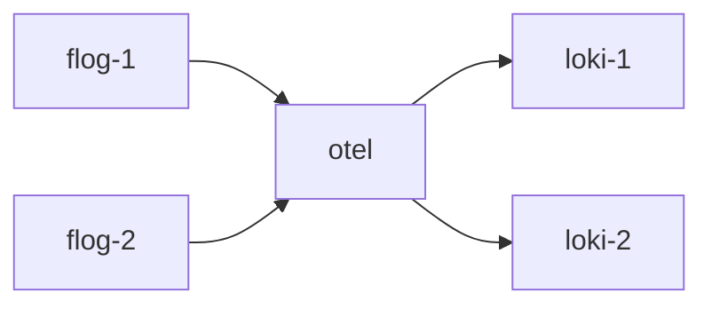

**Date:** 2025-06-03<br/>
**Author:** Michael Thamm (@michaelthamm)  

## Context and Problem Statement
Otelcol pipeline component identifiers provides design flexibility, but also room for bugs. Bugs can include:
1. Overwriting existing component
2. Assigning component to the wrong pipeline
3. Unintentional processing in a pipeline

We have 2 categories of config components: otelcol's private components (e.g. prometheus self-monitoring) and components from relations. 

*For context only*, when looking at the extremes of the pipeline configurations with a config like:


### 1. Extreme - only 1 pipeline
```yaml
service:
  pipelines:
    logs:
      exporters:
        - lokiexporter/1
        - lokiexporter/2
      processors:
        - processor-a
        - processor-b
      receivers:
        - lokireceiver/1
        - lokireceiver/2
```
To define a pipeline component in source code:
```python
self.config.add_component(
	Component.exporter,
	f"loki/{rel.id}",
	{"CONFIG"},
	pipelines=["logs"],
)
```

Pros:
- Easy to identify the required pipeline name `logs/collect-all`
Cons:
- Whatever processor is configured affects the entire pipeline, i.e. all receivers and exporters

### 2. Extreme - one pipeline per relation pair
```yaml
service:
  pipelines:
    logs/one:
      exporters:
        - lokiexporter/1
      processors:
        - processor-a
      receivers:
        - lokireceiver/1
    logs/two:
      exporters:
        - lokiexporter/2
      processors:
        - processor-b
      receivers:
        - lokireceiver/2
```
To define a pipeline component we:
```python
self.config.add_component(
	pipelines=[f"logs/{get_identifier()}"],
```
Pros:
- Processors are well-scoped
Cons:
- This breaks our design principle of "all sources to all sinks"
- `get_identifier()` would need to:
    - return a unique name
    - map to a specific receiver and exporter

---

Coupling the `pipelines` arg to the `add_component` method means that a pipeline is tied to a receiver or exporter rather than it being determined later, once all receivers and exporters are defined. This highlights the difficulties with the `2. Extreme - one pipeline per relation pair` example. Conversely, in `1. Extreme - only 1 pipeline` we can dump everything related to `logs`.

## Suggestions
1. Make otelcol's own components private with an underscore like `prometheus/_self`
2. Receivers should have its identifier include the source relation, e.g. `loki/send-loki-logs-11`
3. Exporters should have its identifier include the sink relation, e.g. `prometheusremotewrite/send-remote-write-5`
4. Do not add `self.unit.name` to identifiers
5. Do not use identifiers in pipeline names, e.g. `metrics`, `logs`, `traces`, etc. but NOT `metrics/identifier`

## Explanations
1. Likely protects against (user error if not) overwriting a pipeline component from dynamic relations. Also protects against custom processors config. The ability to [define custom processors](https://charmhub.io/opentelemetry-collector-k8s/configurations?channel=2/edge#processors) is a relevant example (as well as [this issue](https://github.com/canonical/opentelemetry-collector-k8s-operator/issues/117)) for identifying otelcol's private processors with `/_self`.
2. The `COMPONENT/ENDPOINT-REL_ID` format gives enough context about the source and provides namespace safety
3. Same as `2.`
4. This is only useful if someone is handed a config file without any context, e.g. the file name `/etc/otelcol/config.d/otelcol_0.yaml`, or using `jssh otelcol/0` provides unit context. You could also infer from relation ids.
5. This limits the ability for a single otelcol to do everything that the upstream otelcol can do, e.g. having multiple pipelines per telemetry (`metrics`, `logs`, etc.) type. However, we support [tiering or chaining otelcol](https://documentation.ubuntu.com/observability/how-to/tiered-otelcols/) which scopes each otelcol to a specific function rather than having a monolith. This also eleviates the problem defined in `2. One pipeline per relation pair` where we need to define a pipeline WHEN we define a pipeline component due to the `add_component` method's coupling to pipelines. IFF we say that ALL `metrics`-category components are added to the `metrics` pipeline, then there is no mapping of component to pipelines.